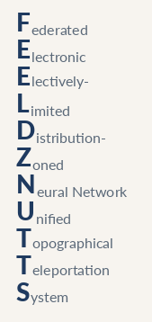

# FAMILIA

**Federated Agents Mesh for Intelligent Local Interoperable Autonomy** · *Federación de Agentes Multi-Inteligentes Locales Interoperables Autónomos*

Your models and data stay on your machine. A file, context, or result moves across boundaries only when you explicitly command it.



FAMILIA is the top-level topology coordinator. It unites local model runtimes, specialized agent personas, and storage transports into a single controllable graph without copying external code or forcing all models into one rigid binary.

---

## Quick Install

Two steps: run the command, then tap through the voluntary contribution notice. Paying is never required.

**Linux, macOS, and Termux:**

```sh
curl -fsSL https://raw.githubusercontent.com/brianreborn/familia/main/install.sh | sh
```

**Windows PowerShell:**

```powershell
irm https://raw.githubusercontent.com/brianreborn/familia/main/install.ps1 | iex
```

Once installed, your local web UI opens on chat: [http://127.0.0.1:9931/?model=chat](http://127.0.0.1:9931/?model=chat). On first visit, paste the API key printed in your terminal.

If you already have the checkout cloned, launch directly:

```sh
./start.sh
```

*(On Windows, run `start.bat`. To install non-interactively in automated environments, set `INSTALL_ACK=yes`.)*

---

## Configuration & Settings

Configure ports, model profiles, and hardware overlays without modifying scripts. Shell environment variables always take precedence.

- **Web Settings Panel** (GUI at [http://127.0.0.1:9932](http://127.0.0.1:9932)):
  ```sh
  python3 scripts/panel.py
  ```

- **Interactive Configuration Shell** (Terminal):
  ```sh
  sh scripts/configure.sh
  ```
  *(On Windows PowerShell: `powershell -ExecutionPolicy Bypass -File scripts\configure.ps1`)*

---

## Engine Co-existence: Multiple llama.cpp Branches & Ollama

Cutting-edge models frequently require unmerged forks, experimental PRs, custom draft speculators, or alternative local runtimes like Ollama. FAMILIA supports running multiple branches and engines side-by-side without collisions:

- **Unambiguous Naming**: Binaries and adapters are suffixed using the double-underscore convention:
  ```
  <executable>__<authorName>__<branchName>
  ```
  *Examples:* `llama-server__ggerganov__master`, `llama-server__ikawrakow__new-quant`, `ollama__ollama__main`.
- **Shared Library Isolation**: Each `llama.cpp` branch build lives in its own isolated directory under `bin/llama__<authorName>__<branchName>/` with `$ORIGIN` runtime linking (`RPATH`), preventing incompatible `.so` / `.dll` ABIs from polluting one another.
- **Ollama Integration**: Runs natively or as a sidecar adapter over its OpenAI-compatible `/v1` loopback endpoint.
- **Unified Route Interface**: Users and agents always speak simple, single-word route names (`chat`, `coder`, `route`, `translate`). The graph preset maps each role to the desired engine behind the scenes.

---

## What You Are Running

| Route | Role | Description |
|---|---|---|
| `chat` | General Conversational | The front door for general queries and discussion |
| `coder` | Code Specialist | Handed code tasks from `chat` or `route` |
| `route` | Nexus Dispatcher | Small resident CPU model that classifies tasks and coordinates handoffs |
| `translate` | Polyglot Translator | Preserves exact code blocks and placeholders across languages |

Specialist roles (`vision`, `transcribe`, `speak`, `draw`, `embed`, `rerank`, `safety`, `guard`) become active automatically when corresponding model weights are placed on disk.

### Component Projects

The sub-projects live in their own checkouts and are tracked by commit hashes in [pins.txt](pins.txt):

| Project | Role |
| --- | --- |
| [code-bootstraps-llama.cpp](https://github.com/brianreborn/code-bootstraps-llama.cpp) | Model inference server, `/remote` advisor, installers, and router |
| [green-roomz](https://github.com/brianreborn/green-roomz) | Alias gateway: one stable name in front of each backend |
| [green-agentz](https://github.com/brianreborn/green-agentz) | Autonomous agent fleet and green-brainz |
| [green-agency](https://github.com/brianreborn/green-agency) | Retired pipeline; referenced for historical specs |
| [Agent-Reach](https://github.com/Panniantong/Agent-Reach) | External reach tools (pinned by commit, not vendored) |

---

## Transactions & Safety

- **/local & /remote**: `/local` executes tools (grok, agy, claude, codex) directly on your machine under your user credentials. `/remote` acts as an advisor for stuck sessions without receiving your local tools or API keys.
- **Atomic Transaction Blocks**: Declare changes with `begin`, verify, and finalize with `commit`. `rollback` reverts declared writes from snapshot before-images.
- **Cache Coherence via Snapshots**: In-memory KV slot states are tied to specific engine builds. Snapshots safeguard state before mutations. Cross-branch transitions transfer clean filesystem state while safely refreshing in-memory KV caches.
- **Least Privilege**: All processes run with standard user permissions. Helpers drop privileges immediately before execution; no `NOPASSWD` sudo rules or persistent administrative rights are required.

---

## License

Code authored in this repository is licensed under the **Light-ware License** in [LICENSE](LICENSE) (4-clause BSD with a voluntary invitation to support rent, groceries, or utilities). Declining the invitation does not affect your rights. Required advertising notice: *"This product includes software developed by Brian Fundakowski Feldman."*

Sub-checkouts retain their respective licenses (e.g. `llama.cpp` remains MIT).

---

## Issues

Search tickets in their respective upstream trackers:

| Area | Issues |
| --- | --- |
| FAMILIA Topology & Graph | https://github.com/brianreborn/familia/issues |
| Models, Server, Installers & Agent | https://github.com/brianreborn/code-bootstraps-llama.cpp/issues |
| green-roomz Gateway | https://github.com/brianreborn/green-roomz/issues |
| green-agentz Fleet | https://github.com/brianreborn/green-agentz/issues |
| green-agency | https://github.com/brianreborn/green-agency/issues |

*Agent-Reach issues remain on [Panniantong/Agent-Reach](https://github.com/Panniantong/Agent-Reach). Upstream llama.cpp issues remain on [ggml-org/llama.cpp](https://github.com/ggml-org/llama.cpp).*
