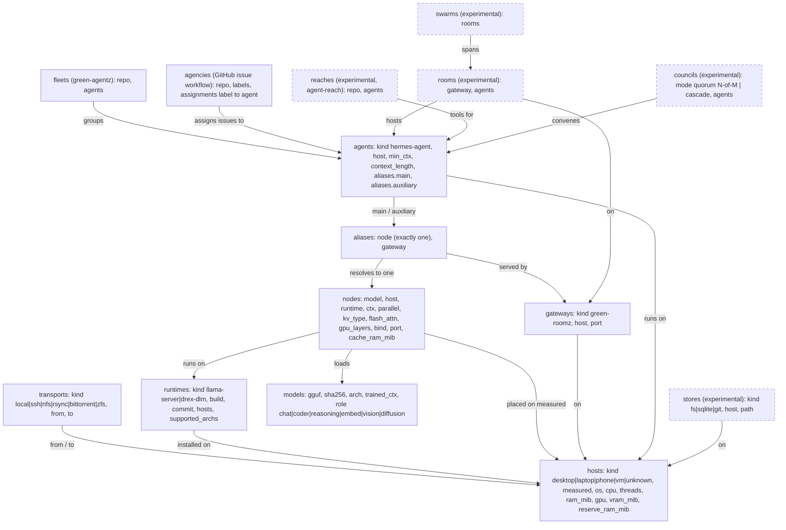

# familia graph types (graph.yaml v2)

`graph.yaml` declares the whole topology: which hosts exist, what runs where,
which model sits behind each route name, and which agents use them. Every
section is a **type** registered in `scripts/graph_types.py`. Every field is
required unless it's marked optional, and nothing has a default. If the graph
doesn't fit the hardware, a runtime, or an agent, the validator fails loudly
instead of choosing something on its own.

```sh
python3 scripts/validate_graph.py              # schema + GGUF metadata + RAM budget
python3 scripts/validate_graph.py --no-files   # schema only (CI, other hosts)
python3 scripts/validate_graph.py --verify-sha # also hash GGUFs against models.*.sha256
python3 scripts/validate_graph.py --args coder # llama-server args for node "coder"
python3 -m pytest tests
```

## Type map



## Rules the validator enforces

| Type | Rules |
|---|---|
| host | `measured: true` requires os, cpu, threads, ram_mib, gpu, vram_mib, reserve_ram_mib. `measured: false` must not carry numeric facts and cannot host nodes. `kind: unknown` is only allowed while unmeasured. |
| transport | `local` must have from == to; every other kind must link two different hosts. |
| runtime | `commit` must be a git sha, since a branch name isn't a pin. `supported_archs` lists only archs verified to load on that build. |
| model | `sha256` is 64 hex characters or the literal `unmeasured`. With files present, `arch` and `trained_ctx` must match the GGUF metadata. |
| node | The host must be measured and the runtime installed on it. The model's arch must be in the runtime's `supported_archs`, which catches gemma-embedding2 on b11374. ctx % parallel == 0, per-slot ctx <= trained_ctx, gpu_layers > 0 needs VRAM, and ports must be unique per host. With files present: cache_ram_mib >= per-slot prompt state, and the sum per host must fit ram_mib - reserve_ram_mib. |
| alias | Resolves to exactly one node: a string, not a list, and duplicate YAML keys are rejected. If the gateway and node are on different hosts, a non-local transport must link them. |
| agent | Roles `main` and `auxiliary` are both required, each mapped to exactly one alias. Every role's per-slot ctx must be >= min_ctx, and `context_length` must equal the main alias's per-slot ctx. |
| fleet | Every listed agent must exist. |
| agency | `repo` is owner/name, and assignments map labels from `labels` to existing agents. |
| room, swarm, store, reach, council | Experimental. They need `experimental: true`. Council `quorum` needs 1 <= quorum <= len(agents). `cascade` runs agents in list order and takes no quorum. |

Unknown sections and unknown fields are errors, so a typo can't quietly do nothing.

## Adding a refined or new type

A new type is one registry entry plus, optionally, one checker function in
`scripts/graph_types.py`:

```python
def check_probe(g, name, p, errs):
    if p["interval_s"] < 5:
        errs.append(f"probes.{name}: interval_s {p['interval_s']} < 5")

TYPES["probes"] = T({
    "target":     req("ref", ref="nodes"),   # must name an existing node
    "interval_s": req("int", min=1),
    "experimental": req("bool"),
}, check_probe, experimental=True, doc="health probe")
```

Field kinds: `str`, `int` (with `min`), `bool`, `enum` (with `choices`), `sha`,
`list` (non-empty strings), `ref`/`refs` (names in another section), and `map`.
Wrap a field in `opt(...)` only when leaving it out has a defined meaning, not
to supply a default.

To **refine** an existing type, such as a new model role, host kind, or
transport kind, add the value to that field's `choices`, add any rules for it
to the type's checker, and add a test in `tests/test_graph_types.py`. To
promote an experimental type, set `experimental=False`, drop its
`experimental` field, and write its real cross-checks. Add the new type to
`REQUIRED_SECTIONS` only if every graph must have it.
